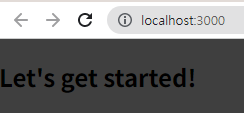
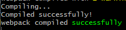

# 리액트(React)란?
> 리액트는 자바스크립트 라이브러리로 사용자 인터페이스를 만드는데 사용된다.

기존에는 웹 사이트에 버튼을 클릭해서 다른 사이트로 가게끔 하는 일이 있었다면
<br> 
웹 반응 -> 또 다른 HTML을 서버에 요청 <br>
서버 응답 -> 웹 렌더

이렇게 서버를 거치므로 굉장히 오랜 시간이 걸렸다. 그러나 리액트를 사용한다면 핸드폰의 앱(App) 처럼 즉각적인 반응을 렌더해서 보여줌으로써 굉장한 반응형 페이지를 구축할 수 있게 된다.


# 왜 react를 써야 할까요?
바닐라 JS는 DOM을 통해서 아이템을 만들고~ 또 클래스를 만들고~ 이벤트 리스너를 만들고~ 굉장히 많은 코드를 입력해야 하고 번거롭기도 하다. 이를 `명령형 접근방식`이라고 한다.
<br> 이후 JS는 한계에 다르게 된다.
<br>우리는 반복적인 작업을 하는 저수준의 코드를 계속해서 짜야하고 실행해야 한다.

그러나 리액트는 응용프로그램을 작은 빌딩 블록과 작은 컴포넌트들로 분할함으로 모든 빌딩 블록, 모든 컴포넌트들은 `명확한 태스크`를 가지고 있다. 이러한 점은 코드의 **유지 보수와 관리가 용이하도록 유지**하게 된다.

즉, 리액트를 연계해서 사용하면 고수준으로 복잡한 사용자 인터페이스 작업을 더 쉽게 구축할 수 있다는 것이다.

# 컴포넌트 (Components)
## 왜 리액트는 컴포넌트가 중요한 개념이 됐을까?
> 모든 사용자 인터페이스들은 결국 컴포넌트로 구성되있기 때문이다.

## 컴포넌트란?
스타일을 만드는 html 코드와 css 코드, 그리고 어떤 로직을 위한 JS의 결합이다.

## 왜 컴포넌트를 채택했지?
1. 재사용이 가능하기 때문이다.
    - 반복을 피할 수 있게 해준다.
2. 우려 사항을 분리할 수 있게 해주기 때문이다.
    - 코드 베이스를 작고 관리 가능한 단위로 유지할 수 있게 해준다.
    - 코드를 여러 파일로 분할할 수 있게 해준다.

## 컴포넌트는 어떻게 만들어졌을까?
HTML - CSS - JS가 결합돼서 만들어진다.

# 🚀 start react project
## 사전 설치
### node.js

[](https://nodejs.org/en)

### Create React App

[](https://github.com/facebook/create-react-app)

리액트 프로젝트를 만들기 쉽게 해준다.

#### 설치
```js
// terminal
$ npx create-react-app my-app
```


자동으로 관련 파일들과 폴더가 생성이 된다.

```js
// terminal
$ cd react-complete-guide
$ npm start
```


자동으로 `localhost:3000`이 열리는 것을 볼 수 있다!
<br>(참고로 더미이다.)

## 기본 - src
### index.js
리액트가 자동적으로 렌더하는 최종 JS 파일이다.
```js
import ReactDOM from 'react-dom/client';

import './index.css';
import App from './App';

const root = ReactDOM.createRoot(document.getElementById('root'));
root.render(<App />);
```
일반 JS와는 다르게 `css`파일도 불러올 수 있다. 해당 css파일은 react를 실행시키면 알아서 해석해서 css까지 불러올 수 있게 된다.

`root.render(<App />)` 을 통해, 해당 리액트 파일은 `App.js`의 내용을 모두 렌더하겠다는 의미가 된다.

### App.js
```js
function App() {
  return (
    <div>
      <h2>Let's get started!</h2>
    </div>
  );
}

export default App;
```
실질적인 render가 되는 부분이다. 



#### JSX
> JavaScript XML로, 자바스크립트에 XML을 추가한 확장 문법이다.<br>
 <br>
> 위 이미지 처럼 자바스크립트에 `HTML` 문법을 가능케 해준다.


#### 여기서 잠깐!!! 왜 App.js는 앞에가 대문자인가?
개발자가 별도로 추가하는 컴포넌트임을 암묵적으로 표현하는 방식이다.

## 컴포넌트 추가하기
### components 폴더 생성
`src/components`폴더를 추가해준 뒤, 해당 폴더에 우리가 넣고 싶은 컴포넌트 파일들을 추가해주게 된다.

### 컴포넌트 생성
개발자가 별도로 추가한 파일이라는 의미에서 가장 앞에 대문자 규칙을 지켜서 폴더를 생성한다. `ExpenseItem.js`


#### 그래서 컴포넌트란?
리액트에서 컴포넌트란 쉽게 말해 함수 + JSX이다. 

```js
function ExpenseItem() {
    return <h2>Expense item!</h2>
}

export default ExpenseItem;
```
위처럼 함수 안에 JSX를 넣어줘서 우리가 원하는 내용을 쉽게 넣어줄 수 있다.

### 해당 컴포넌트를 App.js에 포함시켜서 root 렌더하기
> 잠깐! App.js에 `import`를 시키기 위해선 export할 컴포넌트에 `export default 함수명;`이 꼭 포함되있는지 확인할 것! 안되있다면 import 안됨!

#### 1. ExprenseItem.js import 하기
```js
import ExpenseItem from "./components/ExpenseItem";
```
#### 2. ExprenseItem JSX로 추가하기
```js
// App.js
function App() {
  return (
    <div>
      <h2>Let's get started!</h2>
      {/* --------------------- */}
      <ExpenseItem></ExpenseItem> 
      {/* --------------------- */}
    </div>
  );
}
```
JSX로 내가 원하는 위치에 컴포넌트를 추가해줄 수 있다! <br>✨ JSX로 추가해줄 때는 꼭 HTML처럼 `<함수명></함수명>`으로 태그를 넣어줘야 한다!

#### 3. App.js 저장
React는 렌더되는 JS를 저장해주면 자동으로 서버가 변경 사항을 체크하고, 자동으로 반영되는 것을 볼 수 있다.




```js

```