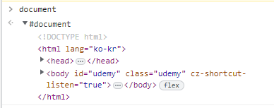
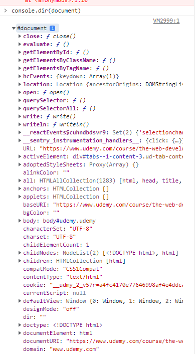

# 230510 TIL

# DOM

> **D**ocunment <br> > **O**bject <br> > **M**odel <br>

> 문서 객체 모델

웹 페이지를 구성하는 JS 객체들의 집합

## Document

> 마치 최상의 폴더다.



JS에는 특정 객체가 있는데, (마치 window같은) 그 중 하나가 document다.

콘솔 창에 `document` 라고 치면 html의 정보가 나온다.

이걸 좀 더 명확하게 보고 싶다면 `console.dir(document)`을 해주면 딕셔너리 형태로 세부 정보를 볼 수 있다.


## Selector

JS에는 CSS의 selector와 같이 사용할 수 있는 메소드가 있다.

### getElementsById

css

```js
document.getElementsById("id명");
```

id 선택자이다. 이걸 변수로 저장할 수도 있다.

```js
const allImages = document.getElementsByTagName("img");
```

이 변수를 토대로 img의 어트리뷰트를 뽑아낼 수도 있다.

```js
const allImages = document.getElementsByTagName("img");

for (let img of allImages) {
  console.log(img.src);
}
```

### getElementsByTagName && ClassName

id만 선택자로 이용할 수 있는 것이 아닌 class와 tag들도 뽑아 쓸 수 있다. <br> getElementsById와 사용 방법은 같다.
<br>

특수한 점은, id는 html에서 단 한 개의 요소에만 쓰이는데에 비해 tag와 class는 여러 요소를 가지고 있음으로, 동일한 class나 tag의 이미지를 한 번에 바꾸는 방법이 있다.

```js
// EX
const squareImages = document.getElementsByClassName("square");
for (let img of squareImages) {
  img.src =
    "https://upload.wikimedia.org/wikipedia/commons/e/e0/Male_Silkie.png";
}
```

### querySelector

> ID, 클래스, 이름, 요소 타입 등 원하는 선택자를 무엇이던 이용하여 선택할 수 있는 메서드

```js
document.querySelector();
```

> ⚠️ 단, 쿼리셀렉터는 **첫 번쨰로 일치**하는 값을 준다.
#### 선택 요소 작성 방법
| 선택 요소 | 작성 방법 |
| --------- | --------- |
| name      | name      |
| class     | .name     |
| id        | #name     |
#### 번외) :nth-of-type 같은 것도 사용이 가능하다.
### querySelectorAll
> 쿼리셀렉터와 같지만, 일치하는 모든 요소를 반환한다.

## Manupulate (조작)
> 항목 이동, 이름 재지정, 스타일 업데이트, 항목 나타내기 / 숨기기 등
> <br> JS로 html, css에 영향을 주는 것
```js

```

```js

```

```js

```

```js

```
