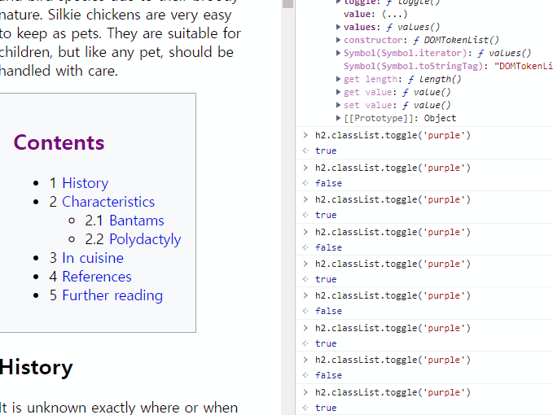
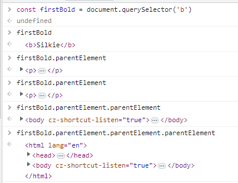
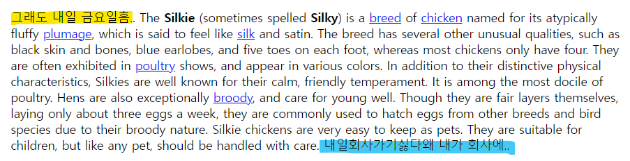

# 230510 TIL

<details>
<summary>목차</summary>

- [DOM](#dom)
- [Document](#document)
- [Selector](#selector)
  - [getElementsById](#getelementsbyid)
  - [getElementsByTagName && ClassName](#getelementsbytagname----classname)
  - [querySelector](#queryselector)
    - [선택 요소 작성 방법](#-----------)
    - [번외) :nth-of-type 같은 것도 사용이 가능하다.](#-----nth-of-type---------------)
  - [querySelectorAll](#queryselectorall)
- [Manupulate (조작)](#manupulate-----)
  - [innerHTML, textContent, innerText](#innerhtml--textcontent--innertext)
    - [innerText](#innertext)
      - [활용](#--)
        - [내용 뽑아내기](#-------)
        - [p 태그의 내용 변경해주기](#p-------------)
    - [textContent](#textcontent)
    - [innerHTML](#innerhtml)
      - [활용](#---1)
        - [HTML 요소 추가](#html------)
  - [Attribute (속성)](#attribute-----)
    - [다른 방법 - 메서드 이용](#--------------)
      - [getAttribute](#getattribute)
      - [setAttribue](#setattribue)
  - [스타일 변경하기](#--------)
  - [classList](#classlist)
    - [내장 method](#---method)
      - [add](#add)
      - [remove](#remove)
      - [contains](#contains)
      - [toggle](#toggle)
  - [계층 이동](#-----)
    - [parant](#parant)
    - [children](#children)
    - [nextSibling && previousSilbling](#nextsibling----previoussilbling)
  - [JS로 html에 요소 추가해주기](#js--html----------)
    - [appendChild](#appendchild)
      - [1. createElement](#1-createelement)
      - [2. 속성 추가](#2------)
      - [3. appendChild](#3-appendchild)
    - [append](#append)
      - [뒤에 추가](#-----)
      - [앞에 추가](#-----)
  - [요소 제거](#-----)
    - [removeChild](#removechild)
    - [remove](#remove-1)

</details>

# DOM

> **D**ocunment <br> > **O**bject <br> > **M**odel <br>

> 문서 객체 모델

웹 페이지를 구성하는 JS 객체들의 집합

# Document

> 마치 최상의 폴더다.


JS에는 특정 객체가 있는데, (마치 window같은) 그 중 하나가 document다.

콘솔 창에 `document` 라고 치면 html의 정보가 나온다.

이걸 좀 더 명확하게 보고 싶다면 `console.dir(document)`을 해주면 딕셔너리 형태로 세부 정보를 볼 수 있다.


# Selector

JS에는 CSS의 selector와 같이 사용할 수 있는 메소드가 있다.

### getElementsById

```js
document.getElementsById("id명");
```

id 선택자이다. 이걸 변수로 저장할 수도 있다.

```js
const allImages = document.getElementsByTagName("img");
```

이 변수를 토대로 img의 어트리뷰트를 뽑아낼 수도 있다.

```js
const allImages = document.getElementsByTagName("img");

for (let img of allImages) {
  console.log(img.src);
}
```

### getElementsByTagName && ClassName

id만 선택자로 이용할 수 있는 것이 아닌 class와 tag들도 뽑아 쓸 수 있다. <br> getElementsById와 사용 방법은 같다.
<br>

특수한 점은, id는 html에서 단 한 개의 요소에만 쓰이는데에 비해 tag와 class는 여러 요소를 가지고 있음으로, 동일한 class나 tag의 이미지를 한 번에 바꾸는 방법이 있다.

```js
// EX
const squareImages = document.getElementsByClassName("square");
for (let img of squareImages) {
  img.src =
    "https://upload.wikimedia.org/wikipedia/commons/e/e0/Male_Silkie.png";
}
```

### querySelector

> ID, 클래스, 이름, 요소 타입 등 원하는 선택자를 무엇이던 이용하여 선택할 수 있는 메서드

```js
document.querySelector("");
```

> ⚠️ 단, 쿼리셀렉터는 **첫 번쨰로 일치**하는 값을 준다.

#### 선택 요소 작성 방법

| 선택 요소 | 작성 방법 |
| --------- | --------- |
| tag       | name      |
| class     | .name     |
| id        | #name     |

#### 번외) :nth-of-type 같은 것도 사용이 가능하다.

### querySelectorAll

> 쿼리셀렉터와 같지만, 일치하는 모든 요소를 반환한다.

# Manupulate (조작)

> 항목 이동, 이름 재지정, 스타일 업데이트, 항목 나타내기 / 숨기기 등
> <br> JS로 html, css에 영향을 주는 것

## innerHTML, textContent, innerText

### innerText

> 요소에 있는 text만 변경해주는 것

#### 활용

##### 내용 뽑아내기

```js
document.querySelector("p").innerText;
```


##### p 태그의 내용 변경해주기


```js
document.querySelector("p").innerText = "아 집에가고싶다.";
```


### textContent

> innerText와 비슷하지만, html 파일의 줄바꿈까지 반영돼서 나옴

```js
document.querySelector("p").textContent;
```


### innerHTML

> 마크업의 전체 내용 출력

```js
document.querySelector("p").innerHTML;
```


#### 활용

##### HTML 요소 추가

```js
document.querySelector("h1").innerHTML += "<sub>dd</sub>";
```


## Attribute (속성)

```js
document.querySelector('img')
document.querySelector('img').src


'https://images.unsplash.com/photo-1563281577-a7be47e20db9?ixlib=rb-1.2.1&ixid=eyJhcHBfaWQiOjEyMDd9&auto=format&fit=crop&w=2550&q=80'
```

이 이미지 태그는 `id`, `src`, `alt` 라는 세 가지의 속성을 가지고 있다. 이를 토대로 내용을 변경해줄 수도 있다.

### 다른 방법 - 메서드 이용

#### getAttribute

```js
const firstLink = document.querySelector("a");
firstLink.href >>> "http://127.0.0.1:5500/wiki/List_of_chicken_breeds";
```

```js
firstLink.getAttribute("href") >>> "/wiki/List_of_chicken_breeds";
```

🤨 왜 저 메소드를 쓰면 값이 다르게 나올까?

> getAttribute 메소드는 JS에서 온 값이기 때문에 html 에 내용을 그대로 가져와서 그런 것.

```js
// 이 속성이 있는지 없는지도 확인할 수 있다.
firstLink.getAttribute("src") >>> null;
```

#### setAttribue

```js
firstLink.setAttribute("href", "www.naver.com");
```

## 스타일 변경하기

```js
h1.style;
```


스타일 목록이 카멜 케이스 (numNum) 으로 정리돼서 나온다.

> ⚠️⚠️그러나! css에서 정의한 스타일은 따로 나오지 않고 **인라인 / 따로 지정** 된 것만 객체 방식으로 나온다.
>
> 1. css에만 스타일이 되어 있을 때
>    
> 2. 인라인에 스타일을 따로 지정해줬을 때
>     

> 단, 콘솔에서 따로 지정이 가능하다.
> (인라인 스타일이 생기는 것)<br> > `h1.style.color = "yellow"` > 

**그렇게 선호되는 방식은 아니다.**

1. 특성의 어떤 한 가지만 작업할 때는 쉬울 순 있으나, 많은 스타일을 적용해야 하거나 한 번에 그것을 다 적용해야 한다면 굉장히 귀찮은 일이 된다.
2. 인라인 스타일을 많이 변경하는 건 효율적이지 않다.

## classList

> `setAttribute`를 하게 되면 하나의 class만 추가해줄 수 있어서, 두 개 이상 추개해주려면 따로 변수를 선언해주고, 그걸 다시 리터럴로 셋어트리뷰트로 넣어주고.. 굉장히 복잡했음.
>
> 즉 **class를 한 번에 여러 개** 넣어주기 어려웠다는 얘기!

### 내장 method

#### add

> 배열의 push() 처럼, 입력한 class 명이 자동으로 추가되는 것

```js
const h2 = document.querySelector("h2");
h2.classList.add("purple");
h2.classList.add("border");
```

```html
<h2 class="purple border"></h2>
```

#### remove

> 특정 클래스를 없애는 것

```js
h2.classList.remove("purple");
```

```html
<h2 class="border"></h2>
```

#### contains

> 해당 클래스가 있는지에 대한 여부를 true / false로 반환

```js
h2.classList.contains('purple');
>>> false
```

#### toggle

> 클래스를 껏다 킬 수 있는 메소드



```js
h2.classList.toggle('purple');
>>> false / true
```

체크박스에서 체크 되고 안되고 등의 기능 구현 가능!

## 계층 이동

### parant

```js
const firstBold = document.querySelector("b");
```



### children

```js
const paragraph = document.querySelector('p')
paragraph.children

>>> HTMLCollection(8) [b, b, a, a, a, a, a, a]0: b1: b2: a3: a4: a5: a6: a7: alength: 8[[Prototype]]: HTMLCollection
```

인덱싱처럼 사용이 가능하다.
`paragraph.children[0]`​

### nextSibling && previousSilbling

1. 노드 반환
   - previousSibling
   - nextSibling
2. 태그 반환
   - previousElementSibling
   - nextElementSibling

## JS로 html에 요소 추가해주기

### appendChild

#### 1. createElement

```js
const newImg = document.createElement("img");
```

> 아직 페이지에 나타난 것은 아니다. 또한 scr 같은 속성도 없다.

#### 2. 속성 추가

```js
// src 추가
newImg.src =
  "https://encrypted-tbn0.gstatic.com/images?q=tbn:ANd9GcTLXUk_c7qN9BPn-xCimRkJJiLwI-Nh04kyNwl5rUcBl5qC5BbKXWlWrzN63JogxafW2C8&usqp=CAU";
```

아직 페이지에 나타나진 않았다.

#### 3. appendChild

```js
document.body.appendChild(newImg);
```


이젠 추가된 HTML을 볼 수 있다!

### append

> 비교적 최근에 나온 메소드. 좀 더 유연해서 노드나 문자열을 바로 넣어줄 수 있다.
> <br> 혹은 한 개 이상의 무언가를 넣어줄 수 있다.

#### 뒤에 추가

```js
const p = document.querySelector("p");
p.append("내일회사가기싫다", "왜 내가 회사에..");
```

#### 앞에 추가

```js
const prepentP = document.querySelector("p");
prepentP.prepend("그래도 내일 금요일", "흠..");
```



## 요소 제거

### removeChild

> 제거하려는 요소의 부모를 호출해서 그 부모에게 removeChild 메서드를 이용하는거임. 조금.. 번거로움

### remove

> removeChild의 상위버전이라고 생각하면 됨 ^\_^
