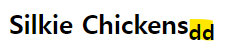

# 230510 TIL

# DOM

> **D**ocunment <br> > **O**bject <br> > **M**odel <br>

> 문서 객체 모델

웹 페이지를 구성하는 JS 객체들의 집합

# Document

> 마치 최상의 폴더다.


JS에는 특정 객체가 있는데, (마치 window같은) 그 중 하나가 document다.

콘솔 창에 `document` 라고 치면 html의 정보가 나온다.

이걸 좀 더 명확하게 보고 싶다면 `console.dir(document)`을 해주면 딕셔너리 형태로 세부 정보를 볼 수 있다.


# Selector

JS에는 CSS의 selector와 같이 사용할 수 있는 메소드가 있다.

### getElementsById

```js
document.getElementsById("id명");
```

id 선택자이다. 이걸 변수로 저장할 수도 있다.

```js
const allImages = document.getElementsByTagName("img");
```

이 변수를 토대로 img의 어트리뷰트를 뽑아낼 수도 있다.

```js
const allImages = document.getElementsByTagName("img");

for (let img of allImages) {
  console.log(img.src);
}
```

### getElementsByTagName && ClassName

id만 선택자로 이용할 수 있는 것이 아닌 class와 tag들도 뽑아 쓸 수 있다. <br> getElementsById와 사용 방법은 같다.
<br>

특수한 점은, id는 html에서 단 한 개의 요소에만 쓰이는데에 비해 tag와 class는 여러 요소를 가지고 있음으로, 동일한 class나 tag의 이미지를 한 번에 바꾸는 방법이 있다.

```js
// EX
const squareImages = document.getElementsByClassName("square");
for (let img of squareImages) {
  img.src =
    "https://upload.wikimedia.org/wikipedia/commons/e/e0/Male_Silkie.png";
}
```

### querySelector

> ID, 클래스, 이름, 요소 타입 등 원하는 선택자를 무엇이던 이용하여 선택할 수 있는 메서드

```js
document.querySelector("");
```

> ⚠️ 단, 쿼리셀렉터는 **첫 번쨰로 일치**하는 값을 준다.

#### 선택 요소 작성 방법

| 선택 요소 | 작성 방법 |
| --------- | --------- |
| tag       | name      |
| class     | .name     |
| id        | #name     |

#### 번외) :nth-of-type 같은 것도 사용이 가능하다.

### querySelectorAll

> 쿼리셀렉터와 같지만, 일치하는 모든 요소를 반환한다.

# Manupulate (조작)

> 항목 이동, 이름 재지정, 스타일 업데이트, 항목 나타내기 / 숨기기 등
> <br> JS로 html, css에 영향을 주는 것

## innerHTML, textContent, innerText

### innerText

> 요소에 있는 text만 변경해주는 것

#### 활용

##### 내용 뽑아내기

```js
document.querySelector("p").innerText;
```


##### p 태그의 내용 변경해주기


```js
document.querySelector("p").innerText = "아 집에가고싶다.";
```


### textContent

> innerText와 비슷하지만, html 파일의 줄바꿈까지 반영돼서 나옴

```js
document.querySelector("p").textContent;
```


### innerHTML

> 마크업의 전체 내용 출력

```js
document.querySelector("p").innerHTML;
```


#### 활용

##### HTML 요소 추가

```js
document.querySelector("h1").innerHTML += "<sub>dd</sub>";
```



## Attribute (속성)

```js
document.querySelector('img')
document.querySelector('img').src


'https://images.unsplash.com/photo-1563281577-a7be47e20db9?ixlib=rb-1.2.1&ixid=eyJhcHBfaWQiOjEyMDd9&auto=format&fit=crop&w=2550&q=80'
```

이 이미지 태그는 `id`, `src`, `alt` 라는 세 가지의 속성을 가지고 있다. 이를 토대로 내용을 변경해줄 수도 있다.

### 다른 방법 - 메서드 이용

#### getAttribute

```js
const firstLink = document.querySelector("a");
firstLink.href >>> "http://127.0.0.1:5500/wiki/List_of_chicken_breeds";
```

```js
firstLink.getAttribute("href") >>> "/wiki/List_of_chicken_breeds";
```

🤨 왜 저 메소드를 쓰면 값이 다르게 나올까?

> getAttribute 메소드는 JS에서 온 값이기 때문에 html 에 내용을 그대로 가져와서 그런 것.

```js
// 이 속성이 있는지 없는지도 확인할 수 있다.
firstLink.getAttribute("src") >>> null;
```

#### setAttribue

```js
firstLink.setAttribute("href", "www.naver.com");
```
## 스타일 변경하기
```js
h1.style
```


스타일 목록이 카멜 케이스 (numNum) 으로 정리돼서 나온다. 
> ⚠️⚠️그러나! css에서 정의한 스타일은 따로 나오지 않고 **인라인 / 따로 지정** 된 것만 객체 방식으로 나온다.
> 1. css에만 스타일이 되어 있을 때
> 
> 2. 인라인에 스타일을 따로 지정해줬을 때
>  

> 단, 콘솔에서 따로 지정이 가능하다.
> (인라인 스타일이 생기는 것)<br>
> `h1.style.color = "yellow"`
> 

**그렇게 선호되는 방식은 아니다.**
1. 특성의 어떤 한 가지만 작업할 때는 쉬울 순 있으나, 많은 스타일을 적용해야 하거나 한 번에 그것을 다 적용해야 한다면 굉장히 귀찮은 일이 된다.
2. 인라인 스타일을 많이 변경하는 건 효율적이지 않다.
```js

```

```js

```

```js

```
