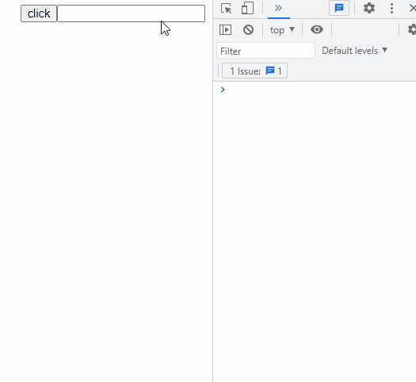
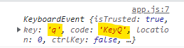
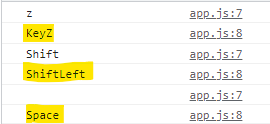
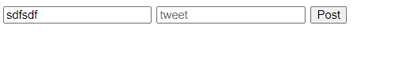
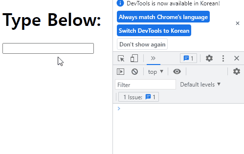
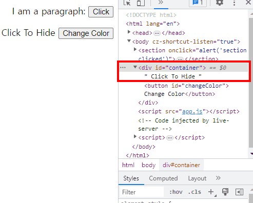
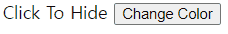
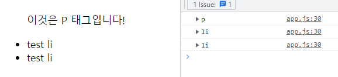

# 230512 TIL

# EVENTS

> 사용자들이 하는 행동에 반응하는 작업

## 이벤트 사용 방법

### 인라인 이벤트


```html
<button onclick="alert('클릭하세욥!!')">클릭하세요!</button>
```

🤷‍♀️ 쓰면 안되는 이유

1. HTML 안에 JS를 쓰는 것은 이상하다.
   - 마크업이 길어지고, 쓸 때도 짜증(ㅋㅋ)이 난다.
   - 계속 따옴표 신경써주는 것도 여간 귀찮다.
   - 여러 이벤트를 넣을려면 계속 세미콜론을 넣어줘야 한다.
2. 동일한 동작을 하는 버튼이 있을 경우
   - 비효율적인 무한 복붙 <= 코드도 길어지기 시작..
   - 많은 양의 동작을 한 번에 바꾸기가 어려움. (코드만 많기 떄문에.)

### JS에 이벤트 작성

> 인라인 이벤트보다 더 나은 방법인 JS에 작성하는 방식이다.<br>
> function으로 기능을 전달해준다.

```js
const btn = document.querySelector("#b2");
btn.onclick = function () {
  console.log("클릭하새요");
};
function scream() {
  console.log("뿌애앵");
}
btn.onmouseenter = scream;
```

```js
document.querySelector("h1").onclick = () => alert("h1을 클릭하셨어요!");
```

#### 단점

동일한 이벤트에 대해 두 개의 서로 다른 콜백 함수를 지정할 수 없다.

### addEventListener (method)

1. 요소 선택

```js
const butoon = document.querySelector("h1");
```

2. 메소드 사용

```js
button.addEventListener("click", () => alert("h1을 클릭하셨어요"));
```

감지하고 싶은 어떤 이벤트든 전달할 수 있다.

## 이벤트와 this

### 왜 사용해야 하나요?

```js
const makeRandColor = () => {
  const r = Math.floor(Math.random() * 255);
  const g = Math.floor(Math.random() * 255);
  const b = Math.floor(Math.random() * 255);
  return `rgb(${r}, ${g}, ${b})`;
};

const buttons = document.querySelectorAll("button");

for (let button of buttons) {
  button.addEventListener("click", function () {
    button.style.backgroundColor = makeRandColor();
    button.style.color = makeRandColor();
  });
}

const h1s = document.querySelectorAll("h1");
for (let h1 of h1s) {
  h1.addEventListener("click", function () {
    h1.style.backgroundColor = makeRandColor();
    h1.style.color = makeRandColor();
  });
}
```

> button과 h1에 사용되는 이벤트가 동일하게 쓰일 떄, 하드코딩을 위해서 쓰입니다.

### 제네릭 함수와 this

```js
for (let button of buttons) {
  button.addEventListener("click", colorize);
}

for (let h1 of h1s) {
  h1.addEventListener("click", colorize);
}

function colorize() {
  this.style.backgroundColor = makeRandColor();
  this.style.color = makeRandColor();
}
```

## 이벤트 객체 && 키보드 이벤트

### 키보드 이벤트

> 게임의 키보드 이벤트 처럼, 키보드로 입력한 내용을 리턴해줌.

#### KeyDown && KeyUp

```js
const input = document.querySelector("input");
input.addEventListener("keydown", function () {
  console.log("keydown");
});
input.addEventListener("keyup", function () {
  console.log("keyup");
});
```



### 키보드 이벤트 값 얻기

```js
const input = document.querySelector("input");
input.addEventListener("keydown", function (e) {
  console.log(e);
});
```



> 우리는 `code` 와 `key` 요소에 주목해야한다.



노란색친 부분이 `code` 값이다.
> 🌟
> <br> 즉, 실제 키보드 **위치에** 대응하는 것은 `code`이다.
> <br>입력된 **값만** 뭔지 알아내려면 `key` 를 이용하면 된다.
## form 이벤트
### submit
```js
const form = document.querySelector('form');
form.addEventListener('submit', function(e){
}
```
> 폼 내용을 펑션에 저장해줄 수 있는 이벤트
### preventDefault
#### 사용되는 이유
폼에 url을 거니 button을 통해 폼에 걸린 url로 이동을 한다.
<br>그러나 로그인이 실패할 경우에도 url로 이동되는 것을 막기 위해 해당 메서드를 이용한다.

```js
const tweetForm = document.querySelector("#tweetForm")
tweetForm.addEventListener('submit', function(e){
    e.preventDefault()
})
```

## 입력과 변경 이벤트
### change 
```js
const input = document.querySelector('input');

input.addEventListener('change', function(e){
})
```
> 입력을 떠날 때 마다(blur) 실행되는 이벤트
>  참고, 따로 콘솔 로그를 넣어준 것이다. 
### input 
```js
const input = document.querySelector('input');

input.addEventListener('input', function(e){
})
```
> 입력값이 바뀔 때 마다 즉각적으로 실행되는 이벤트


#### 어디에 이용될까?
값이 바뀌어야 실행되기 때문에 **복붙은** 따로 감지되지 않는다! + 음성입력도 포함

## Event Bubbling

* 예시 사진
-   ```js
    container.addEventListener('click', function() {
        container.classList.toggle('hide')
    })
    ```

> 이벤트 버블링이란?
> <br> 위 이미지 처럼 div 하위에 button 태그가 있을 경우, div가 아닌 버튼을 클릭해도 div의 hide 클래스를 같이 실행하게 된다.
> <br>이렇듯, 부모 태그에 걸린 이벤트 때문에 하위 이벤트도 같이 영향을 받아버리는 불상사를 이벤트 버블리이라고 한다.

### 방지하는 방법: stopPropagation



button 이벤트에 추가해준  것임!

## 이벤트 위임
> 부모 요소에 이벤트 수신기를 추가하는 것

이벤트 수신기가 추가된 시점에 페이지에 없었던 요소를 다루어야 하는 상황에서 편리하다.

### 예제. 요소 지우기
```html
<h2>Tweets:</h2>
<ul id="tweets">
    <li>test li</li>
    <li>test li</li>
</ul>
```
```js
// default
const tweetForm = document.querySelector('#tweetForm');
const tweetsContainer = document.querySelector('#tweets');
tweetForm.addEventListener('submit', function (e) {
    e.preventDefault();
    const usernameInput = tweetForm.elements.username;
    const tweetInput = tweetForm.elements.tweet;
    addTweet(usernameInput.value, tweetInput.value)
    usernameInput.value = '';
    tweetInput.value = '';
});

const addTweet = (username, tweet) => {
    const newTweet = document.createElement('li');
    const bTag = document.createElement('b');
    bTag.append(username)
    newTweet.append(bTag);
    newTweet.append(`- ${tweet}`)
    tweetsContainer.append(newTweet);
}
```
#### Trouble Shooting
1. li를 지워보자!
```js
const lis = document.querySelectorAll ('li');
for (let li of lis){
    li.addEventListener('click', function(){
        li.remove()
    })
}
```


> 원래 있는 리스트들은 삭제가 되지만, js로 추가해준, 즉, 새로 생성되는 li들은 삭제가 되지 않는 문제가 있다.

2. 위임 후 target으로 지우기!
```js
tweetsContainer.addEventListener('click', function(e){
    e.target.remove()
})
```


> 이벤트 위임으로 새로 생성된 li들도 삭제가 됐지만, p 태그까지 모두 삭제가 되는 상황 발생

3. li target만 삭제 (nodeName 활용)


```js
console.dir(e.target)
```
위 내용으로 확인해보면, target의 nodeName으로 선택하고 있는 태그가 어떤 태그인지 확인해줄 수 있다.
```js
tweetsContainer.addEventListener('click', function(e){
    e.target.nodeName === 'LI' && e.target.remove()
})
```


🌻 해결 완료!