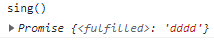
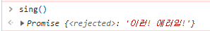

# 230514
<details>
<summary>목차</summary>

- [비동기식 JS](#-----js)
  * [자바는 동기적이다.](#---------)
    + [hoisting 이란?](#hoisting----)
  * [비동기란?](#-----)
  * [들어가기 앞서 CallBack 이란?](#--------callback----)
    + [callback은 동기적/비동기적 처리가 가능하다.](#callback-------------------)
  * [CallStack](#callstack)
    + [Stack](#stack)
    + [예시](#--)
  * [JS가 아닌 브라우저가 실제로 작업하고 있는 것이다.](#js--------------------------)
  * [WebAPI](#webapi)
    + [작동 방식](#-----)
  * [Promises](#promises)
    + [상태](#--)
    + [1. Pruducer](#1-pruducer)
    + [2. Consumers](#2-consumers)
  * [ASYNC 함수](#async---)
    + [ASYNC](#async)
    + [AWAIT](#await)
      - [callback 지옥에서 promise, async 함수까지의 여정 . .](#callback------promise--async-----------)
</details>
<hr>
<br><br>
# 비동기식 JS
## 자바는 동기적이다.
hoisting이 된 이후 부터 코드가 작성한 순서에 맞춰 하나 하나씩 동기적으로 실행된다.
### hoisting 이란?
var변수, 함수 선언 들이 자동적으로 제일 위로 올라가는 것
## 비동기란?
코드가 언제 실행될지 예측할 수 없는 것이다.

## 들어가기 앞서 CallBack 이란?
> "우리가 전달해준 함수를 나중에 네가 불러줘." call 다음 back 해주니까 callback임!!

### callback은 동기적/비동기적 처리가 가능하다.
```js
// 동기적 처리
function printImmediately(print){
   print()
} 
// 브라우저에게 API를 요청하는 비동기적 처리
function printWithDelay(print, timeiut){
   setTimeout(print,timeout);
}
```
<hr>

## CallStack
 

---

**콜 스택이란?**

> JS 해석기가 사용하는 매커니즘으로 여러 함수를 호출하는 스크립트에서 해당 위치를 추적한다.
> <br> 그리하여 JS가 위치를 알 수 있다.
>
> 쉽게 설명하자면 읽던 곳을 표시하기 위해 손👆이나 책갈피 등을 쓰는 것과 같음

### Stack

> 컴퓨터 과학의 기본 데이터 구조
> <br> 후입선출 (LIFO) 데이터 구조로 알려져 있다.
>
> <br> 즉, **가장 늦게 추가된 것을 가장 먼저 제거한다.**

### 예시

```js
const multiply = (x, y) => x * y;

const square = (x) => multiply(x, x);

const isRightTraiangle = (a, b, c) => {
  return square(a) + square(b) === square(c);
};

isRightTraiangle(3, 4, 5);
```

이런 코드를 예시로 생각해보자.

1. `isRightTraiangle(3, 4, 5)` 값을 받아 `isRightTraiangle` 함수는 `3+square(4) === square(5)`의 과정을 가진다.
   
2. 그 다음, square 함수를 호출 및 **스택을 쌓고**, multiply에게 `3` 의 값을 전달해준다.
   
3. `multiply`가 `multiply(3, 3)` 값을 전달 및 **스택을 쌓고** `9` 라는 값을 도출한다.
   
4. `multiply`에서 나온 `9`라는 값으로 `multiply`의 스택은 **제거**되고 `square`에게 9의 값을 전달해준다.
   
5. `square`는 값을 전달해준 뒤 **제거**되고 `isRightTraiangle`은 `9+square(4) === square(5)`라는 `square(a)` 결과를 내준다.
   
6. 이 과정을 계속 진행하다보면 결국 JS는 최종 결과인 **true**를 내준다.

---

🌻 JS는 콜 스택에 함수 호출을 **추가**하고 값이 반환될 때마다 **삭제**한다.

<hr>
<br>
서버에 요청을 보내고 DB 혹은 서버에서 응답을 받고 작동하거나 작동하지 않는 일이 있다고 가정을 한다. 그러면 5초 정도가 소모된다.
<br> 이 과정에서 사용자는 5초, 10초 이상을 기다리게 되고 **사용자에게는 좋은 경험은 아닐 것이다.**

## JS가 아닌 브라우저가 실제로 작업하고 있는 것이다.

`브라우저`는 JS로 작성되는 것이 아닌 대개 `C++`같은 언어로 작성된다.

=> 그래서 **JS가 할 수 없는 일**이 있다. JS는 브라우저에게 특정 작업을 처리하도록 넘긴다.

## WebAPI

> `브라우저는 Web APIs가 있다.` **Web APIs**는 일반적으로 JS에서 호출하여 브라우저로 전달하는 방법이다.

### 작동 방식

```js
console.log("Sending request to server!")
setTimeout(function() {
    console.log("Here is your data from the server...")
}, 3000)
console.log("I AM AT THE END OF THE FILE!")

>>> 
'Sending request to server!'
'I AM AT THE END OF THE FILE!'
// 3초 후
'Here is your data from the server...'
```

1. JS는 `"Sending request to server!"` 콘솔 로그를 인식하고 출력해준다.<br>
 

2. JS의 콜 스택이 WEb API를 인식한다. 


3. JS: 브라우저야.. 나 `setTimeout`이 뭔지 모르겠성 ㅎ 타이머로 3초로 설정해주라 ㅋ 

4. 브라우저: ㅇㅋ 3초 뒤에 실행함. 

5. JS는 그 다음일을 한다. `"I AM AT THE END OF THE FILE!"`을 출력한다.


6. 브라우저는 시간을 체크하고 있고, 시간이 지나면 `"Here is your data from the server..."`를 출력해준다.

## Promises
> 콜백 지옥 (연속되는 실패/성공 branch가 계속 중첩되는 현상) 에서 벗어나게 해주는 하나의 객체이다.
> <br> 최종 값이나 작동 여부에 대한 약속이다.

### 상태
> pending (기다리는 상태) -> fulfilled or rejected

### 1. Pruducer
> 정보를 제공해주는 자

```js
const promise = new Promise((resolve, reject) => {
   // 네트워크 통신 및 파일을 읽는 등의 무거운 일 처리
})
```
사용자가 무언가를 눌렀을 때 네트워크 요청을 해야하는 경우라면, 사용자가 요구하지도 않았는데 **불필요한** 네트워크 통신이 있을 수 있다.

> ⚠️ promise를 만드는 순간, 안에 전달한 executor라는 콜백이 **바로 실행**이 되기 때문에 유의해야한다.
### 2. Consumers
> then, catch, finally를 이용해서 값을 받아올 수 있다.
```js
const promise = new Promise((resolve, reject) => {
    console.log("doing something.. .");
    setTimeout(() => {
        resolve('jiyul');
        reject(new Error('네트워크가 연결되지 않았습니다.'))
    }, 2000);
});
```
```js
promise
    .then((value) => {
    console.log((value));
    }) // 값이 제대로 전달이 되면 출력이 됨!
    .catch(error => {
        console.log(error);
    }) // reject의 경우에 에러 처리를 하게 해줌!
    .finally(() => {
        console.log('finally')
    }) // resolve, reject에 무관하게 무조건 마지막에 실행이 된다.
```

## ASYNC 함수
> 깔끔한 코드 작성을 도와준다.
### ASYNC
> 함수를 비동기 함수로 선언하는 키워드다.
> <br> 자동으로 promises를 반환한다.

```js
async function hello () {
   throw // 오류 반환하게 하는 것
   return 
}
```

< 성공 > 값이 있다면 **promise의 resolved** 상태가 뜬다.



< 실패 > 비동기 함수에 오류가 있다면 **promise의 rejected** 상태가 뜬다.



### AWAIT
> 비동기 코드를 쓰면서 동기적으로 보이게 해준다.
> <br> promise가 값을 반환할 때까지 기다리기 위해 비동기 함수의 실행을 일시 정지 시킨다.

#### callback 지옥에서 promise, async 함수까지의 여정 . . 

```js
// callbakc 지옥
const delayedColorChange = (newColor, delay, doNext) => {
    setTimeout(() => {
        document.body.style.backgroundColor = newColor;
        doNext && doNext();
    }, delay)
}
delayedColorChange('red', 1000, () => {
    delayedColorChange('orange', 1000, () => {
        delayedColorChange('yellow', 1000, () => {
            delayedColorChange('green', 1000, () => {
            })
        })
    })
})
```
```js
// promise
const delayedColorChange = (color, delay) => {
    return new Promise((resolve, reject) => {
        setTimeout(() => {
            document.body.style.backgroundColor = color;
            resolve();
        }, delay);
    })
}

delayedColorChange('red', 1000)
    .then (() => delayedColorChange("orange", 1000))
    .then (() => delayedColorChange("yellow", 1000))
    .then (() => delayedColorChange("green", 1000))
    .then (() => delayedColorChange("blue", 1000))
    .then (() => delayedColorChange("indigo", 1000))
    .then (() => delayedColorChange("pupple", 1000))

///////////////////////////////////////////////////////
// asynk function, await
async function rainbow () {
    await delayedColorChange('red', 1000)
    await delayedColorChange('orange', 1000)
    await delayedColorChange('yellow', 1000)
    await delayedColorChange('green', 1000)
    await delayedColorChange('blue', 1000)
    await delayedColorChange('indigo', 1000)
    await delayedColorChange('pupple', 1000)
}

rainbow().then(() => "레인보우는 끝났어!") // 출력 옵션 1

async function printRainbow(){ // 출력 옵션 2
   await rainbow();
   console.log("레인보우는 끝났어!");
}
printRainbow();
```
