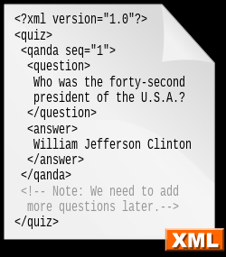

# 230516 TIL

# AJAX (Asynchronous Javascript And XML)

> 코드를 이용해서 HTTP에 요청하는 것
> <br> 비동기식 JS와 XML이다.

- 여기서 X는 XML을 의미하지만 JSON을 의미하는 AJAJ는 뭔가 어감이 이상해서 이젠 AJAX는 JSON을 의미하는 것이라고 함 ㅋㅋ

HTML, CSS, JS가 아닌 순수한 정보를 원한다. 사람의 편의를 위한 코드는 필요하지 않다. 단지 순수한 **데이터만** 필요할 뿐이다.

# API (Apllication Programing Interface)

컴퓨터가 여러 소프트웨어와 상호 작용하거나 소통하는 모든 인터페이스를 의미하는 광범위한 용어

- 웹과는 크게 가까운 용어는 아니다.

## WebAPI

- 웹 개발자가 말하는 API
  > HTTP를 기반으로 하는 인터페이스
  > <br> 다른 애플리케이션이나 DB로 가는 입구이다.

대개의 웹사이트는 API를 무료/유료 공개하고 있으며, 우리가 해당 API를 가지고 와서 다양한 일을 할 수 있다. <br>
`ex. 비트코인 API 가져와서 내 사이트에 2분 마다 업데이트 시키기`

## JSON

API 주소를 가져와보면 이런 데이터가 있다.


> API는 데이터만을 주고 받는데, 이럴 때 쓰는 것이 **JSON** 포맷이다.
> <br> JSON은 정보 자체인 데이터만을 제공하기 위해 존재함으로 가벼운 포맷이다.

---

#### XML

> JSON 이전에 쓰이던 포맷이다. `<태그>내용</태그>` 형식이며, 태그는 개발자가 마음대로 지을 수 있다.

## 

> **J**ava <br> > **S**cript <br> > **O**bject <br> > **N**otation

JS와 관련있을 듯 하지만 관련은 없다함 ㅋㅋ 단지 포맷임. JS 객체와 유사하다.

```json
{
  "firstName": "Jiyul",
  "lastName": "Kim",
  "birth": 2001,
  "active": false,
  "languageExpertise": ["JavaScript", "Python", "MySQL"]
}
```

### JS와의 차이점

1. Key와 Value 모두에 따옴표를 쓴다.
2. undifined를 지원하지 않는다.

### JS에서 JSON 파싱하기

> `JSON.parse(JSON 데이터)`

### JS를 JSON으로 변경하기

> `JSON.stringify(객체)`

- 단, undifined는 지원하지 않음으로 null로 표기가 바뀐다.

### HTTP Verbs(동사)

> 우리가 보낼 수 있는 갖가지 요청이다. <br>
> 각 API마다 사용할 수 있는 verbs가 다르니 주의할 것.

#### 1. GET

정보를 가져올 때 사용한다.

#### 2. POST

데이터를 어딘가로 보낼 때 사용한다. (DB 혹은 특정 공간에 저장하도록 한다.)
