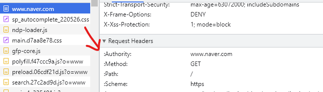

<details>
<summary>목차</summary>

- [AJAX (Asynchronous Javascript And XML)](#ajax--asynchronous-javascript-and-xml-)
- [API (Apllication Programing Interface)](#api--apllication-programing-interface-)
  * [WebAPI](#webapi)
  * [JSON](#json)
      - [XML](#xml)
    + [JS와의 차이점](#js------)
    + [JS에서 JSON 파싱하기](#js---json-----)
    + [JS를 JSON으로 변경하기](#js--json-------)
  * [HTTP 요청](#http---)
    + [HTTP Verbs(동사)](#http-verbs----)
        * [1. GET](#1-get)
        * [2. POST](#2-post)
    + [HTTP Status Code](#http-status-code)
      - [문제 없음! : 2로 시작하는 상태 코드](#---------2------------)
      - [문제있음! : 4로 시작하는 코드](#--------4---------)
        * [404](#404)
        * [405](#405)
      - [서버 사이드 에러 : 5로 시작](#------------5----)
      - [리디렉션과 관계있는 : 3으로 시작](#-------------3-----)
    + [Query Strings (쿼리 문자열)](#query-strings---------)
    + [HTTP headers](#http-headers)
  * [JS로 요청 처리](#js-------)
    + [XMLHttpRequset (Old)](#xmlhttprequset--old-)
    + [FETCH (New!!)](#fetch--new---)
      - [두 번째 요청](#-------)
        * [비동기 함수를 이용한 리팩토링](#----------------)
    + [AXIOS (타사 라이브러리, 네이티브 함수 X)](#axios--------------------x-)

</details>
<br>

# AJAX (Asynchronous Javascript And XML)

> 코드를 이용해서 HTTP에 요청하는 것
> <br> 비동기식 JS와 XML이다.

- 여기서 X는 XML을 의미하지만 JSON을 의미하는 AJAJ는 뭔가 어감이 이상해서 이젠 AJAX는 JSON을 의미하는 것이라고 함 ㅋㅋ

HTML, CSS, JS가 아닌 순수한 정보를 원한다. 사람의 편의를 위한 코드는 필요하지 않다. 단지 순수한 **데이터만** 필요할 뿐이다.

# API (Apllication Programing Interface)

컴퓨터가 여러 소프트웨어와 상호 작용하거나 소통하는 모든 인터페이스를 의미하는 광범위한 용어

- 웹과는 크게 가까운 용어는 아니다.

## WebAPI

- 웹 개발자가 말하는 API
  > HTTP를 기반으로 하는 인터페이스
  > <br> 다른 애플리케이션이나 DB로 가는 입구이다.

대개의 웹사이트는 API를 무료/유료 공개하고 있으며, 우리가 해당 API를 가지고 와서 다양한 일을 할 수 있다. <br>
`ex. 비트코인 API 가져와서 내 사이트에 2분 마다 업데이트 시키기`

## JSON

API 주소를 가져와보면 이런 데이터가 있다.


> API는 데이터만을 주고 받는데, 이럴 때 쓰는 것이 **JSON** 포맷이다.
> <br> JSON은 정보 자체인 데이터만을 제공하기 위해 존재함으로 가벼운 포맷이다.

---

#### XML

> JSON 이전에 쓰이던 포맷이다. `<태그>내용</태그>` 형식이며, 태그는 개발자가 마음대로 지을 수 있다.


> **J**ava <br> > **S**cript <br> > **O**bject <br> > **N**otation

JS와 관련있을 듯 하지만 관련은 없다함 ㅋㅋ 단지 포맷임. JS 객체와 유사하다.

```json
{
  "firstName": "Jiyul",
  "lastName": "Kim",
  "birth": 2001,
  "active": false,
  "languageExpertise": ["JavaScript", "Python", "MySQL"]
}
```

### JS와의 차이점

1. Key와 Value 모두에 따옴표를 쓴다.
2. undifined를 지원하지 않는다.

### JS에서 JSON 파싱하기

> `JSON.parse(JSON 데이터)`

### JS를 JSON으로 변경하기

> `JSON.stringify(객체)`

- 단, undifined는 지원하지 않음으로 null로 표기가 바뀐다.

## HTTP 요청
### HTTP Verbs(동사)

> 우리가 보낼 수 있는 갖가지 요청이다. <br>
> 각 API마다 사용할 수 있는 verbs가 다르니 주의할 것.

##### 1. GET

정보를 가져올 때 사용한다.

##### 2. POST

데이터를 어딘가로 보낼 때 사용한다. (DB 혹은 특정 공간에 저장하도록 한다.)

### HTTP Status Code
#### 문제 없음! : 2로 시작하는 상태 코드
200이 가장 흔한 코드다.

#### 문제있음! : 4로 시작하는 코드
##### 404
1. 사용자나 클라이언트 측에서 잘못되었을 때 뜨는 코드
2. 존재하지 않은 엔드포인트를 입력할 때도 뜬다.
##### 405 
엔드 포인트는 있으나 가령 Get이 아닌 Post 요청은 지원하지 않을 때 뜨는 코드

#### 서버 사이드 에러 : 5로 시작
클라이언트보다 서버 사이드에 문제가 생긴 것

#### 리디렉션과 관계있는 : 3으로 시작

### Query Strings (쿼리 문자열)
> `?sort=desc&color=blue`
><br> `?` 뒤에 `키=값`이 쌍으로 들어가 있는 모습

### HTTP headers
> 요청과 함께 정보를 전달하는 부수적인 방식으로서 응답에 해당된다.
><br> 요청과 함께 보내는 쌍으로 이루어진 정보이다.


## JS로 요청 처리
### XMLHttpRequset (Old)
promise를 지원하기 전이여서 콜백 지옥이 펼쳐질 때.
```js
const req = new XMLHttpRequest;

req.onload = function () {
    console.log("it loaded!")
    const data = JSON.parse(this.responseText)
    console.log(data.name, data.hair_color)
}

req.onerror = function() {
    console.log("ERROR!")
    console.log(this)
}

req.open("GET", "https://swapi.dev/api/people/1")
req.send();
```
req에 중첩되는 콜백들도 많아짐. 구문도 김!!

### FETCH (New!!)
- Fetch 함수로 요청 만들 수 있다.
- promises를 지원한다.
- **단,** JSON을 따로 구문 분석해야 한다.
```js
fetch("https://swapi.dev/api/people/1")
.then (res => {
    console.log("resolved!", res);
    return res.json()
})
.then(data => console.log("JSON Done", data))
.catch (e => {
    console.log("ERROR!", e)
})
```
#### 두 번째 요청
```js
fetch("https://swapi.dev/api/people/1")
.then (res => {
    console.log("resolved!", res);
    return res.json()
})
.then((data) => {
    console.log(data)
    return "https://swapi.dev/api/people/2"
})
.then ((res) => {
    console.log("second resolved!");
    return res.json();
})
.then((data) => {
    console.log(data)
})
.catch (e => {
    console.log("ERROR!", e)
})
```
이런식으로 선형적인 처리가 가능하다.

##### 비동기 함수를 이용한 리팩토링
```js
const loadStarWarsPeople = async () => {
    try {
        const res = await fetch("https://swapi.dev/api/people/1")
        const data = await res.json()
        console.log(data)
        const res2 = await fetch("https://swapi.dev/api/people/2")
        const data2 = await res2.json()
        console.log(data2)
    } catch (e) {
        console.log("ERROR!", e)
    }
};

loadStarWarsPeople();
```

### AXIOS (타사 라이브러리, 네이티브 함수 X)
HTTP 요청의 생성과 처리를 최대한 간소화할 목적으로 만들어 졌다.
- 백그라운드에서는 동일하게 브라우저에 fetch 함수를 사용하지만 JS가 기본 제공하는 함수가 아니므로 추가로 빌드해야 한다.

```js
const getStarWarsPerson = async (id) => {
    try {
        const res = await axios.get(`https://swapi.dev/api/people/${id}`);
        console.log("response", res)
    } catch(e){
        console.log("ERROR", e)
    }
}
getStarWarsPerson(5);
```