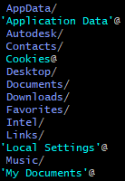
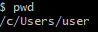

목차

- [Terminal이란?](#terminal---)
  * [터미널을 쓰는 이유](#----------)
    + [1. 속도](#1---)
    + [2.액세스 (Access)](#2-----access-)
    + [3. 많은 툴이 terminal을 기반으로 한다.](#3-------terminal---------)
  * [터미널 용어](#------)
    + [Terminal](#terminal)
    + [Shell](#shell)
  * [터미널 명령어](#-------)
    + [현재 위치에 대한 정보 제공](#---------------)
      - [1. LS (List)](#1-ls--list-)
      - [2. PWD](#2-pwd)
    + [디렉토리 변경 및 폴더 안으로 들어가고 폴더에서 나오기](#------------------------------)
      - [3. CD (Change Directory)](#3-cd--change-directory-)
        * [상대경로 && 절대 경로 ✨✨](#----------------)
          + [절대 경로](#-----)
          + [상대 경로](#-----)
    + [디렉토리 생성](#-------)
      - [mkdir (make directory)](#mkdir--make-directory-)
    + [정보를 주는 역할](#---------)
      - [MAN (Manual)](#man--manual-)
    + [파일 만들기](#------)
      - [touch](#touch)
    + [파일 및 폴더 삭제](#----------)
      - [rm](#rm)
        * [파일 제거](#-----)
        * [폴더 제거](#-----)
        * [플러그](#---)

# Terminal이란?
> 텍스트를 통해 내 기기와 상호작용할 수 있는 텍스트 기반의 프롬프트를 지칭한다.

## 터미널을 쓰는 이유
### 1. 속도
한 줄에 타이핑 하면 한 번에 대여섯 개의 명령어를 실행할 수도 있다!
### 2.액세스 (Access)
- 터미널은 컴퓨터에 대한 모든 액세스 권한 비슷한 것을 제공해준다.
- 보통은 접근이 완전히 금지되어 있는 다양한 설정이나 소프트웨어와 운영 체제의 일부분 같은 것에 대한 액세스 권한 등을 의미한다.
> ✨ 즉, 필요한 영향을 끼칠 수 있는 능력을 부여할 수 있다. 
### 3. 많은 툴이 terminal을 기반으로 한다.

## 터미널 용어
### Terminal
> 원래의 의미 '실체가 있는 물건의 실제 단자' / 키보드 같은 것과 상호작용하는데 쓰였다.
>    현재는 소프트웨어인 terminal를 지칭하는 단어이다.
### Shell
> Teminal에서 실행되는 소프트웨어가 있는 프로그램

옛날에는 terminal이 하드웨어이고 shell이 소프트웨어 이렇게 나눌 수 있었다.

요즘은 이렇게 설명할 수 있다.

Terminal은 실제로 있는 ATM이고 
 Shell은 ATM에서 실행되는 소프트웨어로, ATM을 작동시킨다.

- Shell은 `Bash && Z Shell` 이 두 개가 유명하다.

## 터미널 명령어
### 현재 위치에 대한 정보 제공
#### 1. LS (List)
터미널에 입력할 때마다 현재 있는 디렉토리의 콘텐츠를 나열한다.

#### 2. PWD

 사용자를 위한 홈 디렉토리 이다.

### 디렉토리 변경 및 폴더 안으로 들어가고 폴더에서 나오기
#### 3. CD (Change Directory)
앞으로, 혹은 뒤로 움직일 때 사용한다.
`cd 변경할 디렉토리/`

뒤로 갈떄는 `cd ..` 을 쓰면 된다.

만약 홈디렉토리로 빠르게 이동해야 한다면 `cd ~`를 입력하면 된다.

##### 상대경로 && 절대 경로 ✨✨
###### 절대 경로
루트 디렉토리에서 `/`로 시작한다.  
`user MINGW64 ~ cd /DDC/Content`
어디에서든지 실행할 수 있다.

###### 상대 경로
해당 경로에서 상대적으로 움직일 수 있는 경로

### 디렉토리 생성
#### mkdir (make directory)
`mkdir 만들려는 폴더명`

상위 폴더에 폴더를 만들어주고 싶다면
`mkdir ../folderName`

### 정보를 주는 역할
#### MAN (Manual)
help 명령어 같은 거임 
문서를 보여주는데, `Q` 누르면 나가져요

각 명령어의 플래그 `-` 를 문서화 해서 보여준다. 혹은 이 플래그가 뭔지도 보여준다.

### 파일 만들기
#### touch
`touch test1.txt test2.txt test3.txt . . .`

### 파일 및 폴더 삭제
#### rm 
유의! 컴퓨터의 휴지통으로 가는 게 아닌 **영구 삭제** 이다.
##### 파일 제거
`rm test1.txt test2.txt test3.txt . . .`
##### 폴더 제거
단, 빈 폴더에만 작동한다.

`rmdir folderName`

##### 플러그
`rm -rf`  
- 비어 있지 않은 디렉토리를 제거할 때 쓰인다.
- 중첩 디렉토리가 여러 개 있어도 한 번에 삭제할 수 있다.
- r = 반복 / f = force(강행)