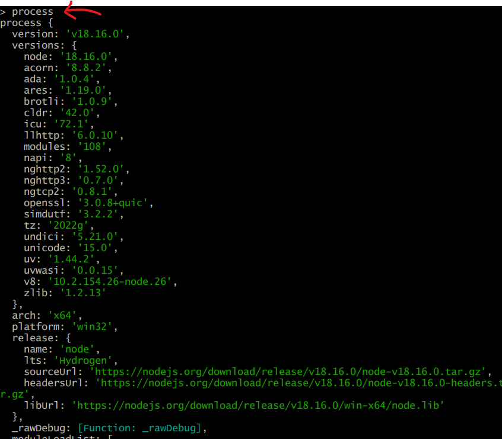

<details>
<summary>목차</summary>

- [Node](#node)
  * [실질적인 쓰임새](#--------)
    + [1. 풀스택 애플리케이션 (웹 서버 만들기)](#1----------------------)
    + [2.명령줄 도구](#2------)
    + [3. NAtive Apps](#3-native-apps)
    + [4. 비디오 게임](#4-------)
    + [5. 드론 소프트웨어](#5---------)
  * [nodeREPL](#noderepl)
    + [node JS VS client-side JS](#node-js-vs-client-side-js)
- [node.js](#nodejs)
  * [process](#process)
    + [argv : 명령줄에서 인수 받기](#argv--------------)
  * [fs (File System)](#fs--file-system-)
    + [mkdir (async)](#mkdir--async-)
    + [mkdirSync](#mkdirsync)
    + [writeFileSync](#writefilesync)
    + [폴더 인수를 토대로 html/css/js 파일 한 번에 생성하기](#-----------html-css-js-------------)

</details>
<hr>

# Node
브라우저 밖에서 작동되는 JavaScript의 실행 환경이다.

클라이언트 측에선 할 수 없던 것을 node에서 가능하게 되고, 관련 애드온 등이 급격하게 상승이 되면서 방대한 커뮤니티 있다. 이러한 장점들로 인하여 `node.js를 안쓸 이유가 없는  것이다!`

## 실질적인 쓰임새
### 1. 풀스택 애플리케이션 (웹 서버 만들기)
> 웹 서버 구축, 즉 서버 측 로직을 써서 풀스택 애플리케이션을 만든다.

지금은 서버를 요청하는 코드를 브라우저에 node없이 작성할 수 있다. AJAX로 API를 요청해서 정보를 받고 브라우저에서 작업할 수도 있다.

> 🌻 하지만? 나만의 API를 만들고 싶고, 내 DB를 만들어 웹 서버를 연결하고 풀 앱을 만들고 싶다면?

이럴 때 가능하게 하는 것이 node.js다.

### 2.명령줄 도구
> 명령줄 도구: 전통적 사용자 인터페이스가 없는 경우에 명령줄에서 실행되는 애플리케이션을 뜻한다.

### 3. NAtive Apps
VSCode나 Twith, Slack 같은 것이 node.js로 만들었다는 사실! 그래서 웹에서도 실행이 가능한 것이다.

### 4. 비디오 게임
cross code 같은 게임!

### 5. 드론 소프트웨어

## nodeREPL
> REPL : 읽고 평가하고 출력
> <br>
> <br> 코드를 콘솔에 입력하면
> <br> 코드를 읽고 평가하고
> <br> 뭔가를 출력한다.

```js
// terminal
PS C:\Users\> node
Welcome to Node.js v18.16.0.
Type ".help" for more information.

.exit
```
단, 코드를 작성하거나 실행할 수는 없다.

### node JS VS client-side JS
브라우저에서는 `window`가 전역 객체 였지만 node js 에서는 `global`이 전역 객체이다.

# node.js


## process
> node에서 사용하는 객체이다. 전역 범위에 있고, 사용하고 있는 node의 정보를 포함한다.


### argv : 명령줄에서 인수 받기 

```js
// greeter.js
const args = process.argv.slice(2);
for (let arg of args) {
    console.log(`hi, ${arg}`)
}
```

```js
// 명령줄
$ node greeter.js jiyul rusty
hi, jiyul
hi, rusty
```

## fs (File System)
> fs는 자동으로 생기는 것이 아니다.
```js
const fs = require('fs');
```

### mkdir (async)
```js
const fs = require('fs');

fs.mkdir('Dogs', { recursive: true}, (err) => {
    console.log("in the callback")
    if (err) throw err;
})
console.log("i come after mkdir")
```
```js
//terminal
$ node boilerplate.js
i come after mkdir
in the callback
```
### mkdirSync
순차적으로 실행되기 때문에 디렉토리 생성을 먼저 해야하는 상황 등에서 유용하게 쓰인다.

### writeFileSync
파일 생성

### 폴더 인수를 토대로 html/css/js 파일 한 번에 생성하기
```js
const fs = require('fs');
const folderName = process.argv[2] || 'Project'

try {
    fs.mkdirSync(folderName);
    fs.writeFileSync(`${folderName}/index.html`,"")
    fs.writeFileSync(`${folderName}/app.js`,"")
    fs.writeFileSync(`${folderName}/style.css`,"")
} catch(e) {
    console.log("뭔가 잘못됐음.")
    console.log(e)
}
```
```js
$ node boilerplate.js portfolio
```

와! 번거로움 줄었다!