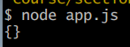
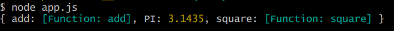
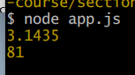

<details>
<summary>목차</summary>

- [module](#module)
  * [module.export](#moduleexport)
  * [패키지](#---)
</details>
<hr>

# module

## module.export
두 개의 js 파일을 이어주고, 출력하게 도와준다.

1. 1차 시도
```js
// math.js
const add = (x,y) => x + y;

const PI = 3.14350;

const square = x => x * x;
```
```js
// app.js
const math = require('./math')
console.log(math)
```
>
math.js에서 app.js로 기능을 전달해주지 않았기 때문에 빈 객체가 반환된다.

2. 2차 시도 (module.export 사용)
```js
// math.js
const add = (x,y) => x + y;

const PI = 3.14350;

const square = x => x * x;

module.exports.add = add;
module.exports.PI = PI;
module.exports.square = square;
```

> 
값이 아닌 해당 모듈의 기능이 반환이 됐다.

3. 3차 시도 (인수 넣어주기)

```js
// app.js
const math = require('./math')
console.log(math.PI)
console.log(math.square(9))
```


원하던 value가 출력됐다.

4. 불러올 객체만 구조 분해하기
```js
// app.js
const {PI, square} = require('./math')
console.log(PI)
console.log(square(9))
```

- export 할 변수를 객체로 묶어 한 번에 moudule.export 하기
```js
// math.js
const math = {
    add: add,
    PI: PI,
    square: square
}

module.exports = math;
```
- exports shorthand
```js
exports.square = square;
exports.PI = PI;
```

## 패키지
여러 개의 js파일을 하나의 js에 불러오면서, 해당 파일을 다른 디렉토리에서 호출해줄 수 있다.

해당 js들은 `shelter`라는 폴더에 저장되어 있다.
```js
// blue.js
module.exports = {
    name: 'blue',
    color: 'grey'
}
```
```js
// numnum.js
module.exports = {
    name: 'numnum',
    color: 'black'
}
```
```js
// rare.js
module.exports = {
    name: 'rare',
    color: 'tuxedo'
}
```
```js
// index.js (node.js 에서 특수한 파일인데, 집합점을 만들어주는 파일이다.)
const blue = require('./blue')
const numnum = require('./numnum')
const rare = require('./rare')

const allCats = [blue, numnum, rare];
console.log(allCats); 
```
```js
// terminal
$ node index.js
[
  { name: 'blue', color: 'grey' },
  { name: 'numnum', color: 'black' },
  { name: 'rare', color: 'tuxedo' }
]
```
해당 index.js 파일을 완전 다른 디렉토리에서 열어볼 수 있을까?

답은 쌉가능! 이다.
```js
// index.js
module.exports = allCats;
```
```js
// 상위 폴더 - app2.js
const cats = require('./shelter');

console.log("required an entire directory", cats)
```
```js
$ node app2.js
required an entire directory [
  { name: 'blue', color: 'grey' },
  { name: 'numnum', color: 'black' },
  { name: 'rare', color: 'tuxedo' }
]
```
