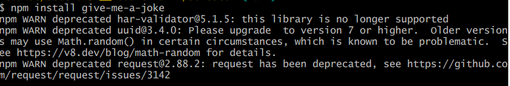
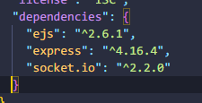
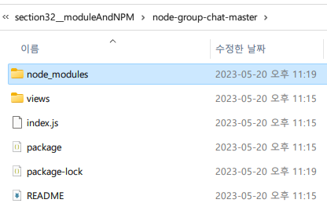

<details>
<summary>목차</summary>

- [npm (node packge manager) = node 커뮤니티](#npm--node-packge-manager----node-----)
  * [npm 패키지 설치 및 실행](#npm------------)
    + [예시. give-me-a-joke 패키지](#---give-me-a-joke----)
      - [1. npm 설치](#1-npm---)
  * [패키지 지역 설치 && 전역 설치](#------------------)
    + [전역 설치 예시. cowsay](#---------cowsay)
  * [package.json 이란?](#packagejson----)
    + [터미널에서 쉽게 package.json 파일 만들기](#---------packagejson-------)
    + [우리가 설치한 npm dependencies는 패키지.json에 추가 된다!](#--------npm-dependencies-----json--------)
      - [유용한 이유](#------)
    + [패키지가 포함된 폴더 공유하기](#----------------)
</details>
<hr>

# npm (node packge manager) = node 커뮤니티

> npm이란?<br> 
> npm에는 두 가지의 정의가 있다.
> 1. 헤아릴 수 없이 많은 패키지로 된 라이브러리
> 2. 명령줄 도구
>       - 이 도구를 사용해서 패키지들을 손쉽게 설치하고 관리할 수 있다.

## npm 패키지 설치 및 실행
[]('https://www.npmjs.com/')

npm 사이트에 들어가면 여러 패키지를 찾을 수 있다! 

### 예시. give-me-a-joke 패키지
#### 1. npm 설치

```js
// 패키지 이름을 똑같이 입력해야 설치가 된다.
npm install give-me-a-joke

// shorthand
npm i give-me-a-joke
```
그러면 내가 지정한 폴더에 이렇게 패키지가 설치된 모습을 볼 수 있다.

```js
// index.js
const jokes = require("give-me-a-joke")
jokes.getRandomDadJoke (function(joke) {
    console.log(joke);
});
```
```js
const jokes = require("give-me-a-joke")
console.log(jokes)
```


이렇게 하나의 패키지에 다양한 콜백 함수가 있다. 관련된 내용은 공식 npm 문서를 참고하면 된다.


우리는 여기서 `getRandomCNJoke` 함수를 호출하면 관련 joke가 나온다!
```js
const jokes = require("give-me-a-joke")
jokes.getRandomDadJoke (function(joke) {
    console.log(joke);
});
```


## 패키지 지역 설치 && 전역 설치
패키지는 보통 버전 관리 때문에 지역 설치로 진행된다.

패키지는 전역 설치도 가능하긴 하다.

### 전역 설치 예시. cowsay
```js
npm install -g cowsay
```
`-g` 라는 플래그를 이용해서 설치한다.

## package.json 이란?
> 특정 프로젝트나 패키지, 앱에 대한 메타 데이터 / 즉 정보를 지니고 있다. 
> <br> 라이선스, 패키지 name 등의 정보


### 터미널에서 쉽게 package.json 파일 만들기
```js
$ npm init
```
명령줄에 해당 명령어를 입력하면


package.json을 만들 수 있는 기본 템플릿이 생성 되면서 우리는 값을 넣어준다.


Ta-da! 이렇게 쉽게 package.json이 생성된다!

### 우리가 설치한 npm dependencies는 패키지.json에 추가 된다!


그래서 만약 해당 npm을 쓰지 않으려면 package.json 디펜던시에서 삭제하면 된다. (= 모듈과의 싱크를 끊는 행위다.)

#### 유용한 이유
1. 착수 중인 작업에 대한 기록을 남길 수 있다.
2. 다른 사람이나 다른 기기에서 내 자신에게 이 파일을 공유할 때 실제로 이 모든 디펜던시들을 한 번에 바로 다운로드 할 수 있다.

### 패키지가 포함된 폴더 공유하기
> 모듈에는 수~많은 폴더와 파일이 있기 때문에 이것을 한 번에 공유하는 것은 비효율적이다.
>
> 그래서 package.json에 디펜던시 목록을 토대로 터미널에 `npm i` 혹은 `npm install`을 적어주면 해당 목록의 **패키지 모듈을 한 번에 다운**받을 수 있다!
>
> 
> 
> 이렇게 디펜던시가 포함된 `node_modules` 폴더가 자동으로 생성된다.
