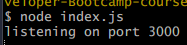
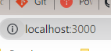
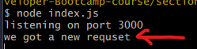
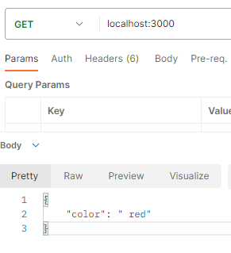
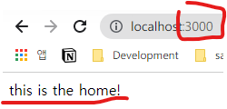
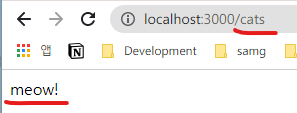
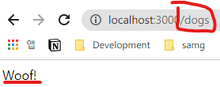
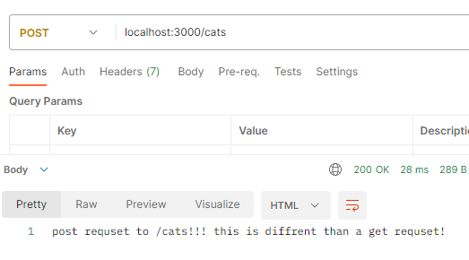

# 들어가기 앞서 . . Framework VS Library
둘 다 다른 사람이 작성한 코드를 npm에서 다운받아서 쓰는 것으로 공통점이 있지만, `framework`에는 `제어와 제어의 역전` 이라는 목적과 목표가 있다.

`라이브러리`는 언제든지 우리의 코드의 결합할 수 있다. 언제 결합할지 결정하거나 어떻게 사용할지를 결정하는 메서드와 기능을 제공한다. 그리하여 **제어권은 우리**에게 있다.

`프레임워크`는 구조를 제공하는 곳이나 애플리케이션의 프레임워크에서 제어의 흐름을 역전시키기 때문에 **우리는 거의 제어에 관여하지 않는다.**
<br> 우리는 프레임워크의 작동 원리에 따라 우리의 코드를 작성할 뿐이다. <br>
그 이유는, 프레임워크는 모든 앱 개발을 돕기 때문이다. 

그에 반해 **라이브러리는 단일 목적의 역할만** 한다.

#  Express
> 웹 애플리케이션 제작을 도와주는 웹 개발 프레임워크 (node 패키지) 이다.

## 1. 설치 및 서버 실행, 요청 확인
1. 설치
```js
$ npm i express
```
터미널에서 해당 명령어를 입력해서 express 모듈을 받아온다.

2. 서버 실행
```js
// index.js
const express = require('express')
const app = express()

app.listen(3000, () => {
    console.log('listening on port 3000')
})
```
listen의 인자에 있는 `3000`의 의미는 `포트`이다. 우리의 서버가 어느 포트에서 연결을 받을 것인지를 확인하게 된다.

터미널에서 `index.js`를 실행시키면


listen 함수의 적은 로그가 출력이 된다. 이 말은 **3000포트의 서버에 접속 받을 준비가 됐어!** 로 받아들일 수 있다.

3. 요청 확인
```js
// index.js

app.use (() => {
    console.log('we got a new requset')
})

// app.listen 함수 위
```
이후 우리가 서버에 접속을 하게 될 때 서버는 응답을 확인하기 위해 `use` 함수를 사용하게 된다.



이렇게 해당 서버에 접속한 요청을 받으면 `use` 콜백이 실행된 모습을 볼 수 있다.

## 요청 및 응답 객체

들어오는 모든 요청은 `app.use`에서 자동으로 전달되는 두 개의 매개변수에 접근한다.
```js
app.use ((req, res) => {
})
```

### 1. 들어오는 요청을 의미하는 객체 `req` (requst)

Express가 자동으로 HTTP 요청 정보를 파싱해 JS 객체를 만들고 그것을 콜백의 첫 번째 인수로 전달한다.

즉, HTTP 요청을 받아들인다.

### 2. 응답을 의미하는 객체 `res` (response)
`res.send` 메서드는 HTTP 응답을 보내고 생성한다.

요청을 한 누군가에게 보내질 응답을 생성하는데 쓰인다.

`res.send`는 string뿐만 아니라 JS 객체, json으로 응답해줄 수도 있다.

### 예시

```js
app.use ((req, res) => {
    console.log('we got a new requset')
    res.send({color :" red"})
})
```
## 라우팅
### 라우팅이란?
> !! Express에서 개발하는 서버에만 한정된 것이 아니다!!
>
> 요청과 요청된 경로를 가져와서 응답을 갖는 어떠한 코드에 맞추는 것을 의미한다.

### 하나 이상의 응답 얻기
이전에 쓴 `app.use` 메서드는 `res.send`로 응답을 보낼 때 하나의 요청으로 끝나버렸다.

그리하여 하나 이상의 응답을 얻는 HTTP 요청을 받을 수 없었다. 그리하여 우리는 하나 이상의 응답을 얻기 위해 `app.get` 메서드를 이용해보려 한다.

#### app.get
예로 들어 
```js
'/' =>  home
'/cats' => 'mewo'
'/dogs' => 'woof'
```
라는 여러 응답을 받으려고 한다.

```js
app.get('/', (req, res) => {
    res.send('this is the home!')
}) // '/'는 루트 라우팅이라는 의미이다.
app.get('/cats', (req, res) => {
    res.send('meow!')
})
app.get('/dogs', (req, res) => {
    res.send('Woof!')
})
```




우리가 `get`을 여러 개 작성한 응답들이 제대로 응답하는 것을 볼 수 있다!

##### 제네릭 get
설정한 라우팅 외에 get 응답을 한 번에 예외 처리해버릴 수 있다.
```js
app.get('*', (res, req) => {
    res.send(`I don't know that path!`)
})
```
제네릭 get은 가장 상단에 두면 모든 다른 라우팅이 예외 처리 되버리니까 주의하자.

<hr>

우리는 현재 **Get 요청에만** 응답하고 있다.


#### app.post
```js
app.get('/cats', (req, res) => {
    res.send('meow!')
})
app.post('/cats', (req, res) => {
    res.send('post requset to /cats!!! this is diffrent than a get requset!')
})
```


**Get**으로 요청을 보냈다면 'meow'로 응답을 준다.

### 제네릭 패턴
레딧을 예시로 들자면 `https://www.reddit.com/r/anime/` 와 같은 subreddit 있다면 `r/subreddit` 와 같은 패턴을 하고 있는 것을 볼 수 있다.

이처럼 라우팅은 대게 제네릭 패턴을 가지고 있다. 

#### 구현하기
```js
app.get('/r/:subreddit', (req, res) => {
    console.log('this is subreddit!')
})
```
이렇게 해두면 `/r/something`을 해도 'this is subreddit!'이 뜬다.
```js

```
```js

```